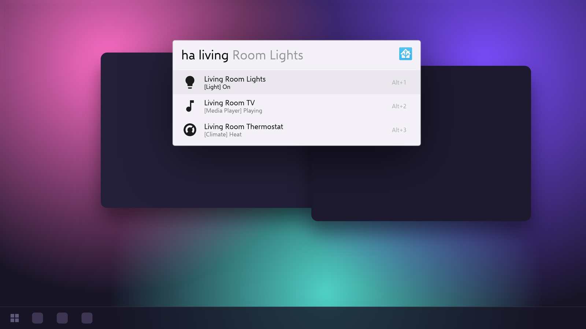

<!-- generated by readwright from docs/README.md.j2; edit the template, not this file -->


# HA-Commander

Search and control your Home Assistant entities from Flow Launcher.

[](https://github.com/Garulf/HA-Commander/actions/workflows/tests.yml) [](https://github.com/Garulf/HA-Commander/releases/latest) [](https://github.com/Garulf/HA-Commander/releases/latest)

[](https://www.buymeacoffee.com/garulf) [](https://github.com/sponsors/Garulf)

## Features

* **Search everything.** Find any entity by name or `entity_id`.
* **One key to act.** `Enter` toggles lights and switches, runs scripts and scenes, presses buttons and cycles thermostat modes.
* **Rich context menu.** Services, light colors and effects, media sources and every attribute, one `Shift+Enter` away.
* **Brightness from the search bar.** `ha kitchen 40` sets the kitchen lights to 40%.
* **Browse by domain.** `ha #` lists your domains, `ha light.` lists your lights.
* **Logbook and error log.** `ha @` shows what just changed, `ha !` shows what went wrong.
* **Theme-aware icons.** Material Design icons that follow your Flow Launcher theme.

## Usage

Type `ha` followed by an entity name or `entity_id`, then press `Enter` to run its default action:

```
ha living
```


| Query | Result |
| --- | --- |
| `ha <name>` | Entities whose name or `entity_id` matches |
| `ha <domain>.` | Only entities in that domain, e.g. `ha light.` |
| `ha #` | Every domain. Select one to browse its entities |
| `ha <light> <0-100>` | Set a light's brightness |
| `ha @` | Recently changed entities from the logbook |
| `ha !` | The Home Assistant error log, newest first |

### Browse by domain

Type `#` to list your domains. Selecting one fills in the domain filter:


### Set light brightness

Add a number between 0 and 100 after a light:


### Logbook

`ha @` lists recently changed entities, newest first. Select one to jump to it:


### Context menu

Open the context menu (`Shift+Enter` or right-click) for the entity's services, light colors
and effects, media player sources and select options, and its attributes. Select an attribute
to copy it:


### Hide entities

Choose **Hide Entity** at the bottom of the context menu to remove noisy entities from the results:


## Installation

### Flow Launcher

In Flow Launcher, type:

```
pm install ha-commander
```


### Manual installation

Download `HA-Commander-<version>.zip` from the [latest release](https://github.com/Garulf/HA-Commander/releases/latest) and unzip it into
`%appdata%\FlowLauncher\Plugins`, then restart Flow Launcher.

Pre-releases of the next version are published from the open release PR on the
[releases page](https://github.com/Garulf/HA-Commander/releases) for testing. Flow Launcher won't offer them as updates.

## Configuration

Open **Settings → Plugins → HA-Commander** in Flow Launcher:

| Setting | Default | Description |
| --- | --- | --- |
| URL | `http://localhost:8123` | Your Home Assistant URL, including the port |
| Token | | A long-lived access token. Create one under [Profile → Security](https://my.home-assistant.io/redirect/profile_security/) in Home Assistant |
| Verify SSL | `true` | Reject invalid or self-signed certificates |
| Max results | `50` | The most results to show. Lower is faster |

## Requirements

* Flow Launcher 1.17.0 or newer
* Python 3.8 or newer, which Flow Launcher can install for you

## Changelog

### [5.2.1](https://github.com/Garulf/HA-Commander/releases/tag/v5.2.1) - 2025-01-09

- fix: mediaplayer attribute error by @Gh0stExp10it in https://github.com/Garulf/HA-Commander/pull/68

### [5.2.0](https://github.com/Garulf/HA-Commander/releases/tag/v5.2.0) - 2024-06-27

- Update flox lib from 0.18.1 to 0.20.1 by @Garulf in https://github.com/Garulf/HA-Commander/pull/59
- Fix select options by @Garulf in https://github.com/Garulf/HA-Commander/pull/62
- Added button entity class by @Hobbit44 in https://github.com/Garulf/HA-Commander/pull/60
- Handle lights with no effects attribute by @Garulf in https://github.com/Garulf/HA-Commander/pull/63

#### Special Thanks

I would like to thank the following for their contributions and support
@robertoleonardo and @Hobbit44 and anyone who has reported bugs and helped.
Thank you

### [5.1.1](https://github.com/Garulf/HA-Commander/releases/tag/v5.1.1) - 2023-03-23

- Fix current source by @Garulf in https://github.com/Garulf/HA-Commander/pull/44

See [CHANGELOG.md](CHANGELOG.md) for the full history.
